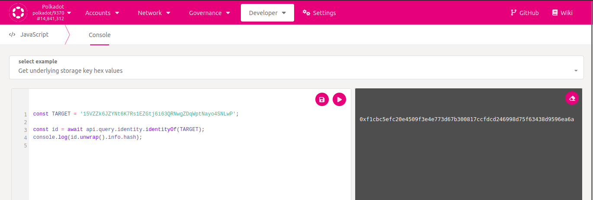

# Support / Manual Judgements Guide

This document describes how moderators that are responsible for the W3F
Registrar support should verify identities and troubleshoot any issues.

## Manual Verifications

Some fields such as legal name or web require manual verification. Additionally,
sometimes a user cannot complete a manual verification for whatever reason.

The moderator must ask for some sort of proof in order to verify a specific field,
which varies depending on context and situation. **The moderator is ENTRUSTED to
make a LEGITIMATE JUDGEMENT before manually verifying an identity**. In general,
for the fields that need to be manually verified the most, the following
process can be used to acquire proof:

* `web`: Multiple options are possible:
	* Check if the website **references the Kusama or Polkadot address** of the given
	identity. If not, ask the user to update the website first.
	* If the specified `email` **is verified and has the same domain** as
	`web`, then this information might be sufficient and implies that the user
	of the identity owns that domain (unless it's obvious that this is not the
	case, such as `gmail.com`).
* `email`: Make sure **you send an email to the user** and ask the user to
  repeat the message back to you. This tells you whether the given email address received
  your message (**do not trust incoming emails**, email spoofing is possible).
* `legalname`: if the "legal name" replicates the name of the **verified** web
  domain, then no further vetting is required. If the legal name is the name of
  a private person, then using **some social media site like LinkedIn** is useful
  (use the integrated LinkedIn chat, for example). Asking for ID is overkill,
  generally.
* `displayname`: If there's a collision with an other identity, ask the user to
  change the display name unless he/she has a good explanation on why the
  display name should be allowed (sometimes identities use very generic terms
  like "stake" in their names, which might result in a collision). Sometimes the
  user already has a different identity with a similar name, in a case like that
  compare the identity fields such as email, web, etc. to determine whether the
  user owns those multiple identities. Note that users should often use
  [sub-accounts](https://wiki.polkadot.network/docs/learn-identity#sub-accounts)  that inherit on-chain info if they have multiple accounts.

### Verify a field manually

To verify a field type of an identity, send the following to the bot:

```
verify <ADDRESS> <FIELD>..
```

where `<FIELD>` can be one of `legalname|displayname|email|web|twitter|matrix|all`

For example:

```
verify 1a2YiGNu1UUhJtihq8961c7FZtWGQuWDVMWTNBKJdmpGhZP web legalname
```

### Re-issue judgement

Verifying `all` re-issues a judgement for the given identity to the Polkadot or
Kusama network. Send the following to the bot:

```
verify <ADDRESS> all
```

## Get judgement state (status)

Without having to access the database, the bot can send you the status of the
(pending) judgement state.

NOTE: In order to avoid spamming the Element support room with verbose
information, please **only request status via private DM with the bot**.

```
status <ADDRESS>
```

## Automated Matrix/Element verification does not work

Ask the user to paste the challenge in the public support room. Alternatively,
verify manually.

## Automated email verification does not work

The challenge must be sent in **plain text** in the **email body** (not
subject). Any text formatting or decorations done by email clients can prevent the
registrar service from verifying the challenge. Alternatively, verify manually.

## Identity does not show up in the registrar UI

The UI only fetches information from **pending** judgement requests.

* Go to a block explorer like https://www.subscan.io/ on check whether the
  identity has sent a `requestJudgement` extrinsic.
* Make sure that no `cancelRequest` extrinsic was issued.
* If the identity was already judged by the registrar, a **new**
  `requestJudgement` extrinsic must be sent.

Do note that updating the identity fields while a judgement request is pending
does not require the user to send a new `requestJudgement` extrinsic. The UI
should update changes automatically as long as there already is a pending
judgement request.

## Identity changes do not update in the registrar UI

The UI only fetches and updates information from **pending** judgement requests,
same as ["Identity does not show up in the registrar UI"](#identity-does-not-show-up-in-the-registrar-ui)

## Something is wrong behind the scenes

If something appears to be wrong in the backend, please contact someone from
DevOps and describe what the issue is and what you're trying to achieve.

## Raw (manual) Judgements (polkadot.js.org)

If, for whatever reason, the registrar service cannot issue judgements, then those can be constructed manually in polkadot.js.org.

First, create a hash of the identity by going to _Developer_ > _Javascript_ and pasting the following code and executing it:

```javascript
const TARGET = '15VZZk6JZYNt6K7Rs1EZGtj6i63QRNwgZDqWptNayo4SNLwP';

const id = await api.query.identity.identityOf(TARGET);
console.log(id.unwrap().info.hash);
```




Make sure to adjust `TARGET` with the address of the account you want to manually verify. Once executed, **copy** the displayed checksum.

Then, go to _Developer_ > _Extrinsics_ and on behalf of the Registrar account, use the Registrar Proxy to proxy the extrinsic _identity -> provideJudgement_.


Set the appropriate account to be judged (`TARGET`), set the judgement to **Reasonable** and **paste the checksum** in the `identity` field. Then, execute.

FYI, the official Registrar accounts (to proxy as) are:

* Kusama: H4XieK3r3dq3VEvRtqZR7wN7a1UEkXxf14orRsEfdFjmgkF
* Polkadot: 12j3Cz8qskCGJxmSJpVL2z2t3Fpmw3KoBaBaRGPnuibFc7o8

The proxy accounts themselves are in the 1password vault.
