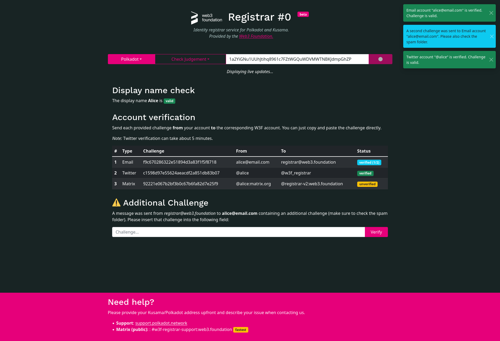

[](https://circleci.com/gh/w3f/polkadot-registrar-challenger)

# Polkadot Registrar Bot (beta)

An automated registrar service for [Polkadot on-chain identities](https://wiki.polkadot.network/docs/learn-identity).

* UI: https://registrar.web3.foundation/



## About

This service ("the challenger") is responsible for veryifing accounts and
providing a HTTP and websocket API to the UI. The full list of features
includes:

* Verification
  * Display name
  * Email
  * Twitter
  * Matrix
* API
  * Websocket API for live notifications and state changes.
  * Rest API for display name checks.
* Communication with [the watcher](#watcher-service)
  * Request pending judgement.
  * Request active display names of other identities.
  * Send judgement to the watcher to issue a judgement extrinsic.

On judgement request, the challenger generates challenges for each specified
account (email, etc.) of the identity and expects those challenges to be sent to
the registrar service by the userfor verification. Display names are verified by
matching those with the display names of already verified identities and
deciding on a judgement based on a [similarity
ranking](https://en.wikipedia.org/wiki/Jaro%E2%80%93Winkler_distance).

## Watcher Service

This service only verifies identities, but does not interact with the
Kusama/Polkadot blockchain directly. Rather, it communicates with [the
watcher](https://github.com/w3f/polkadot-registrar-watcher) which is responsible
for any blockchain interaction.

## Web App / UI

The UI can be found in the [`www/`](./www) directory, which is automatically
built and deployed via [Github Actions](./.github/workflows/gh-pages.yml).

## Config

Both types of configuration, respectively the _adapter listener_ and _session
notifier_ can be seen in the [`config/`](./config) directory.

### Adapter Listener

```yaml
db:
  uri: mongodb://localhost:27017/
  name: registrar_db
instance:
  role: adapter_listener
  config:
    watcher:
      - network: kusama
        endpoint: ws://localhost:8000
      - network: polkadot
        endpoint: ws://localhost:8001
    matrix:
      enabled: false
      homeserver: homeserver
      username: username
      password: password
      db_path: db_path
      admins: null
    twitter:
      enabled: false
      api_key: key
      api_secret: secret
      token: token
      token_secret: secret
      request_interval: 300
    email:
      enabled: false
      smtp_server: server
      imap_server: server
      inbox: inbox
      user: user
      password: password
      request_interval: 5

```

### Session Notifier

```yaml
db:
  uri: mongodb://localhost:27017/
  name: registrar_db
instance:
  role: session_notifier
  config:
    api_address: 0.0.0.0:8000
    display_name:
      enabled: true
      limit: 0.85

```

## Building

To build the binary:

```console
$ apt-get update
$ apt-get -y install --no-install-recommends \
	lld pkg-config openssl libssl-dev gcc g++ clang cmake
```

And to run the service:

```console
$ cargo run --release --bin registrar
```

To build the UI (adjust any values in the config):

```console
$ cd www/
$ cat config.json
{
        "http_url": "https://registrar-backend.web3.foundation/api/check_display_name",
        "ws_url": "wss://registrar-backend.web3.foundation/api/account_status"
}
$ yarn build # output in dist/
```
